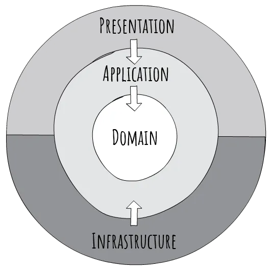

# What Is Clean Architecture?

Clean Architecture is a software design approach that separates concerns and enforces boundaries between different parts of your system

# Why should we use?

As your system grows, tightly coupled code turns small changes into breaking ones. If your domain logic depends on Entity Framework, ASP.NET controllers, or some external API, any refactor can trigger a cascade of unintended side effects.

Clean Architecture flips that dependency flow, infrastructure depends on the core, not the other way around.

# Clean Architecture Principles:

- **Separation of Concerns:** Different concerns (e.g., UI, business logic, data access) are isolated into distinct layers.
- **Platform/Framework Independence:** The core logic of the application does not depend on external frameworks, making it easier to swap frameworks or upgrade them without affecting the core logic.
- **Testability:** Clean Architecture encourages writing unit tests for the business logic independently of external dependencies. This separation allows for efficient and comprehensive testing of the core functionality without requiring integration tests for every minor change.
- **Dependency Rule:** Dependencies should point inward, towards the core of the application. Outer layers depend on inner layers, but inner layers are independent of outer layers.

# Separating concerns:

By separating concerns, you give each layer one job:

## Domain Layer

The Domain layer should never reference any other projects in your solution. It’s designed to be completely independent of frameworks, databases, and user interfaces. This ensures that the core of your application remains isolated and free from any unnecessary dependencies, making it easier to maintain and evolve over time.

It knows nothing about EF Core, HTTP, or even that it’s running in a web app. It’s 100% pure C#, and that’s the point.

📁 Domain
├── 📁 Entities
├── 📁 Enums
├── 📁 Constants
└── 📁 ValueObjects

Reduced to the essential distinction, identity matters for entities, but does not matter for value objects. For example, someone's Name is a value object. A Customer entity might be composed of a customer Name (value object), List<Order> OrderHistory (List of entities), and perhaps a default Address (typically a value object). The Customer Entity would have an ID, and each order would have an ID, but a Name should not; generally, within the object model anyway, the identity of an Address probably does not matter.

### Value Objects

Value objects can typically be represented as immutable objects; changing one property of a value object essentially destroys the old object and creates a new one, because you're not as concerned with identity as with content. Properly, the Equals instance method on Name would return "true" as long as the object's properties are identical to the properties of another instance.

You probably create value objects without realizing it; anytime you are representing some aspect of an Entity by creating a fine-grained class, you've got a value object. For example, a class IPAddress, which has some constraints on valid values but is composed of simpler datatypes, would be a value object. An EmailAddress could be a string, or it could be a value object with its own set of behaviors. It's quite possible that even items that have an identity in your database don't have an identity in your object model.

### Entities (business objects with rules)

Changing some attribute of an entity like Customer doesn't destroy the customer; a Customer entity is typically mutable. The identity remains the same (at least once the object has been persisted).